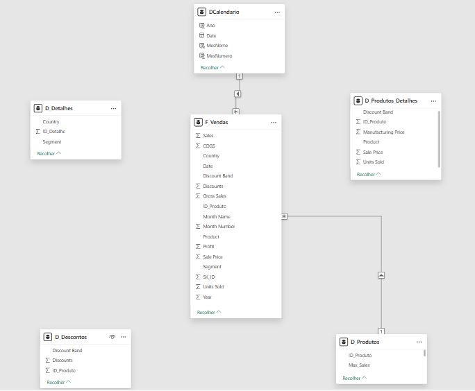

# 📊 Modelagem Star Schema no Power BI

## 🎯 Objetivo

O objetivo deste projeto foi aplicar conceitos de modelagem dimensional no Power BI, transformando uma base única (Financial Sample) em um modelo **Star Schema**, otimizado para análise de dados e construção de relatórios.

---

## 🔧 Processo de construção

O modelo foi desenvolvido a partir de uma única tabela de origem. A partir dessa base, foram criadas cópias para construção das tabelas fato e dimensão, selecionando e transformando apenas as colunas necessárias para cada contexto.

As principais etapas foram:

* Importação da base no Power BI
* Criação de uma tabela de apoio (`financials_origem`)
* Tratamento e padronização dos dados no Power Query
* Separação dos dados em tabelas fato e dimensões
* Criação de chaves (ID_Produto e SK_ID)
* Organização das colunas conforme o contexto analítico

---

## 🧩 Estrutura do modelo

### 📊 Tabela fato

**F_Vendas**

Contém os principais dados para análise:

* SK_ID
* ID_Produto
* Date
* Country
* Segment
* Discount Band
* Units Sold
* Sale Price
* Sales
* Profit

---

### 📦 Tabelas dimensão

**D_Produtos**

* ID_Produto
* Métricas agregadas (média, mediana, máximo e mínimo de vendas)

**DCalendario**

* Date
* Ano
* Mês Número
* Nome do Mês

**Tabelas auxiliares (sem relacionamento direto):**

* D_Produtos_Detalhes
* D_Detalhes
* D_Descontos

---

## 🔗 Relacionamentos

O modelo foi estruturado em formato **Star Schema**, com a tabela fato no centro e dimensões conectadas diretamente a ela:

* D_Produtos → F_Vendas
* DCalendario → F_Vendas

As demais tabelas foram mantidas sem relacionamento para evitar ambiguidade e manter o modelo mais simples e organizado.

---

## 🧠 Funcionalidades utilizadas

### Power Query

* Remoção de duplicados
* Agrupamento de dados (Group By)
* Mesclagem de tabelas (Merge)
* Criação de colunas de índice
* Transformação de tipos de dados

---

### DAX

```DAX
DCalendario = CALENDAR(
    MIN(F_Vendas[Date]),
    MAX(F_Vendas[Date])
)
```

Funções utilizadas:

* `CALENDAR`
* `YEAR`
* `MONTH`
* `FORMAT`

---

## 📸 Modelo Star Schema



---

## 🚀 Resultado

O projeto resultou em um modelo dimensional estruturado, facilitando a análise dos dados, melhorando a organização e permitindo maior eficiência na construção de relatórios no Power BI.

---

## 📌 Observações

Projeto desenvolvido como prática de modelagem de dados no Power BI, com foco em boas práticas de organização e estruturação para análise.
